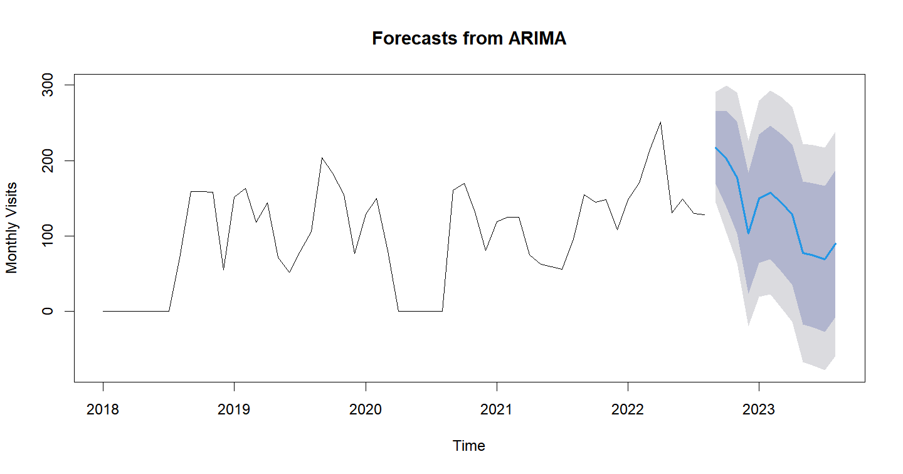

Forecasting Student Numbers at Feed-A-Bull Pantry USF

Chandni Kumari Raghav Khurana Venkata Sai Gagan Deep Alusuri Lakshmi
Preetam Gupta Dogiparthi

> ***Abstract***—**We have gathered the survey data of the students
> coming into the USF Feed-a-Bull pantry over the last 4 semesters
> (2018-2022). Our goal is to estimate the number of students who would
> be coming to the pantry each day. We have utilized time-series
> forecasting models in addition to data visualization tools to present
> the findings of our analysis. We present results of trends over the
> last 4 semesters, predictions using the models, and also what could
> potentially be done to make the system more efficient.**

## Introduction

> A university food pantry is located inside or close to the university.
> For both students and staff, free food is available in the university
> pantries. They work along with local nonprofit organizations, National
> food banks like Feeding Tampa, and university authorities. Students
> who require extra assistance paying for groceries are served by
> university pantries. They don’t merely apply to employees and
> students. Many pantries are open to everybody in the society.

Under Student Health Services (SHS) at USF, we have a similar food
pantry for students on the Tampa campus. Feed-A-Bull, an initiative
spearheaded by Student Health Services and Feeding America Tampa
Bay, strives to alleviate food hardship and hunger among all enrolled
USF students by providing supplemental food, nutrition education, and
resources to **any student in need -- whatever their situation** -- to
ensure their academic success at USF. The
confidential pantry was created as a response to the knowledge
that approximately 30 percent of students face food insecurity while
attending the university for a variety of reasons, and supplemental food
assistance may allow these students to focus on their studies. There are
two ways in which students can avail of the services of this pantry
either by ordering it online and scheduling a pick-up date. And a Drop
in option where the students can hand-pick the items.

## Motivation

COVID-19 was declared a global pandemic by the World
Health Organization on March 11, 2020. As the world enters the third
year of a crisis that has claimed so many lives and livelihoods, one of
the most difficult challenges has been dealing with food
insecurity.

Thirty-five million Americans, or 10.5% of US families, experienced food
insecurity the year before the current COVID-19 pandemic. Since March
2020, this number has increased dramatically; some experts believe the
rate has doubled. Before the pandemic, a staggering 30 percent of all
college students experienced insecurity at some point in their college
careers. Based on the most recent Hope Survey from the fall of 2020, 38%
of two-year college students and 29% of four-year college students
reported food insecurity.

College students' academic performance and health can suffer as a result
of food insecurity. Students who are food insecure are more likely to
report stress and depression symptoms. The impetus for finding the
highly significant factors is to determine the root cause of food
insecurity on college campuses. We also want to scout the most
correlated factors, causing this food insecurity, and compare them to
pre-pandemic data. Ref:
https://www.healthaffairs.org/do/10.1377/forefront.20220127.264905/

## 

## 

## 

## Business Objective

- To predict the number of students who will be
  > visiting weekly to Feed-A-Bull.

- To provide data-driven insights by comparing the
  > statistics pre-pandemic and post-pandemic data.

- To summarize the category of students who will be
  > most vulnerable to experiencing food insecurity.

## Data

During operating hours, students have two options for collecting
supplies. They can walk in or place a private online order for
customized foods. Either way, a student is given a survey form to be
filled out before he/she can place an order. We have gathered the survey
data from the Fall to Summer semesters from the year 2018 to 2022(Till
22nd August). The variables considered for the analysis are shown in
Table 1, and a sample bar graph of the data collected in the year 2022
is shown in Graph 1.

| **Variable**                      | **Description**                                                                                 |
|-----------------------------------|-------------------------------------------------------------------------------------------------|
| Date                              | The date on which the student visited the pantry. Values range from 22-Aug-2018 to 22-Aug-2022. |
| UID                               | Student ids (Anonymized)                                                                        |
| is.first.time                     | Whether it is their first time visiting the pantry                                              |
| is.employed                       | Employment status                                                                               |
| is.food.bought.insufficient       | Whether the food bought in the last 30 days was insufficient.                                   |
| is.affordable.balanced.meal       | Whether the meals they could afford were nutritiously balanced                                  |
| inadequate.meal.size.due.to.funds | Whether they could afford adequate meal portions                                                |
| insufficient.money.for.food       | Whether they had sufficient funds for food                                                      |
| cut.or.skip.meal                  | Whether they had to cut or skip meals                                                           |
| frequency.cut.or.skip.meal        | Frequency of the meals skipped                                                                  |

*Graph 1: Sample of the data collected*

## Methodology

### Exploratory Data Analysis

We were provided with 4 flat files of survey data from the Fall to
Summer semesters of the years 2018 through 2022 of the students visiting
the pantry. The survey consisted of some basic questionnaires regarding
the food insecurity of the students. We cleaned the data and considered
a few key variables that were common across all the files for this
analysis.

#### Seasonality

We observed fairly consistent trends during certain months, the
following line graph(Graph 2) depicts the seasonality of the number of
visitors to the pantry. While there is no significant long-term trend
throughout these years, we observe that March and April experience a
spike in the number of visitors, followed by a gradual decline. August
and September were the busiest months until 2022, with a significant
increase in the numbers as compared to other months. There was no data
collected from March 2020 to September 2020 due to Covid19 lockdown and
restrictions.

#### Weekly Trends

Graph 3 depicts the weekly trends associated with the number of students
visiting the pantry. We observe definite peaks during Wednesdays,
followed by a slight decline during Thursdays, which seem to be the
busiest days of the pantry. After a slight fluctuation, these graphs
level off after Fridays, with Saturdays observing the least number of
visitors.

*Graph 2: Long term trend in the number of visits.*

*Graph 3: Seasonality week-wise in the number of visits*

### Calendar Heatmap

The following calendar heatmap shows daily and weekly trends as the
relative number of visitors every day in a calendar view. Individual
cells use color gradients to represent the data.

*Graph 4: Calendar heatmap for visitor numbers from 2018-2022.*

### Data Smoothing

Graph 5 depicts the daily trends in the number of visitors to the
pantry, however, the data is too noisy to interpret the seasonality. In
order to fix that, we explored two different techniques of data
smoothing-Triangular Moving Average, and Kernel Smoothing. As observed
in Graph 6, kernel smoothing, which takes weighted averages regulated
based on a kernel function, performed slightly better with a smoother
curve at a bandwidth of 4.

*Graph 5: Seasonality for each day from 2018-2022*

> *Graph 6: TMA vs Kernel Smoothing Technique*

Results

### Time Series Analysis using Prophet

The key objective of this study was to predict the number of students
visiting the Feed-A-Bull pantry during the next few months. In order to
perform a time series analysis, we used the Prophet package released by
Facebook’s data science team to forecast the number of visitors. Since
the results from exploratory data analysis containing several seasons of
historical data showed seasonal effects, prophet was the ideal tool for
predicting changes in trends of this data.

Graph 7 shows the model fit using Prophet. We can observe that the trend
in the numbers has been stationary throughout the five year period. For
the year 2022, we can observe that the numbers have increased steeply,
beginning right from the Fall semester. The weekly component shows that
the numbers peak on Wednesdays and Thursdays.

*Graph 7- Actual vs. Prophet predicted values and a forecast for 365
days in Prophet.*

*Graph 8- Model components*

### 

### Model Evaluation Results

# **Diagnostics**

### Cross validation

Prophet includes functionality for time series cross validation to
measure forecast error using historical data. This is done by selecting
cutoff points in the history, and for each of them fitting the model
using data only up to that cutoff point. We can then compare the
forecasted values to the actual values.

The initial model will be trained on the first 600 days of data. It will
forecast the next 60 days of data (because horizon is set to 60). The
model will then train on the initial period + the period (1,825 + 30
days in this case) and forecast the next 60 days. It will continued like
this, adding another 30 days to the training data and then forecasting
for the next 60 until there is no longer enough data to do this.In
summary, period is how much data to add to the training data set in
every iteration of cross-validation, and horizon is how far out it will
forecast.

cv_results = cross_validation(mod, initial = '600 days', horizon = '60
days', period = '30 days')

## 

RMSE tells you how many units your model is wrong on
average. In our data, the RMSE will tell you how many students you can
expect the model to miss in every forecast.

In a nutshell — on an average day, the predictions
are off by 4.

## 

## **<u>Conclusions and Implications</u>**

- The model seems to predict a sharp rise in the numbers compared to the
  > previous semesters.

- The model needs to be tuned by having an additive trend with a
  > multiplicative seasonality into it.

- Change points where there is a sharp rise(During August and January)
  > Identify these seasonal change points and provide it to the model.
